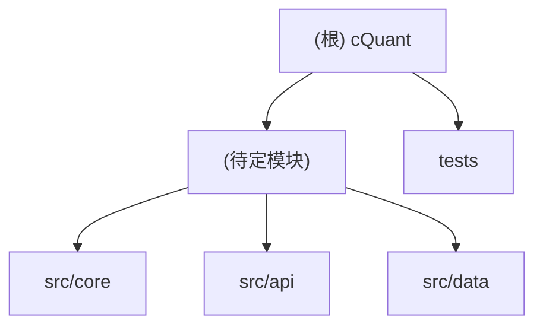

# cQuant — 项目文档

> 初次扫描时间：2026-05-11T11:18:07+08:00
> 当前状态：**Phase 0-4 完成**（因子→ML→信号→优化→回测→风控→AI Advisor→MCP Server）

---

## 变更记录 (Changelog)

| 日期 | 操作 | 说明 |
|------|------|------|
| 2026-05-11 | Phase 1 Step 1 | 环境初始化：environment.yml、pyproject.toml、CI、configs、scripts、目录骨架 |
| 2026-05-11 | 初始生成 | 自动扫描空目录，生成文档骨架 |
| 2026-05-17 | Phase A | TDX 数据集成：TdxDuckDBConnector、批量摄取、silver 层数据（6,675 股票，3M+ 行） |
| 2026-05-17 | Phase B | 研究增强：回测持久化、bt_analyzer 持久化、20 个因子、端到端验证 |
| 2026-05-17 | Phase C | CLI 模块：cquant 命令行工具（ingest、bootstrap、factors、backtest、status） |
| 2026-05-19 | Phase 1.5 | 关键修复：止损、回撤熔断、Sortino/VaR/CVaR/Beta、涨跌停动态、Kelly/TargetVol |
| 2026-05-19 | Phase 2.0 | 基本面因子（30个）、因子评估、多因子策略、ML标签/预处理、杠杆/行业限制 |
| 2026-05-19 | Phase 2.5 | PurgedKFold、MVO/BL Sizer、CompositeStrategy、DAGPipeline |
| 2026-05-19 | Phase 3.0 | API Server 测试、Web build fix、Plugin manifests |
| 2026-05-20 | Phase P0 | DAG引擎接入、动态lookback、silver_fundamentals、ML预测持久化、MLModelStrategy |
| 2026-05-20 | Phase P1 | IR/TE/Alpha指标、HWM追踪、DrawdownBreaker分级、SectorLimit自动加载、因子评估扩展 |
| 2026-05-20 | Phase P1b | CLI多数据源、PaperBroker风控、API认证、数据质量过滤、pyproject.toml依赖 |
| 2026-05-20 | Phase P2 | 协方差估计器、ATR止损、时间止损、LightGBM特征重要性、会话持久化 |
| 2026-05-20 | Phase P3 | 行业轮动/市场中性策略、benchmark指标接入、portfolio_opt集成、组合快照修复 |
| 2026-05-22 | Phase 0 | Qlib 子模块集成：qlib_bridge 封装层（_compat、data_handler、evaluator、factor_set）+ Alpha158 因子（50 个 Polars 实现） |
| 2026-05-22 | Phase 1 | UI Bug 修复：sonner Toast、ConfirmDialog、ErrorBoundary、策略表单校验、404 页面 |
| 2026-05-22 | Phase 2 | 回测评估增强：异步回测（BackgroundTasks + job_id 轮询）、IR/TE/Alpha 展示、过拟合分析触发、CSV/JSON 导出 |
| 2026-05-22 | Phase 3 | 因子研究+ML 打通：Rank IC 衰减图、分层收益图、换手率卡、FactorsPage/MLLabPage 流程步骤、创建策略跳转 |
| 2026-05-22 | Phase 4 | AI Advisor 升级：SessionStore SQLite 持久化、FastMCP server（mcp_server）、IntentRouter 事件路由 |
| 2026-05-22 | Phase 0-B | Vibe-Trading 集成：526 因子（qlib158+alpha101+gtja191）、引擎对比文档、Swarm 加载器（29 团队）、LLM 供应商适配器（14 供应商） |
| 2026-06-02 | Phase 5 | Research UX：DataTable 组件、Factor DSL（parser+evaluator+16 函数）、FactorDSLEditor（Monaco）、策略版本管理（50 版本+回滚）、fills 分页、自动过拟合分析、ScoringPage 改进（分布图+CSV 导出）、ML 模型→策略导航、Monaco chunk 分离、响应式布局 |

---

## 项目愿景

cQuant 是一个 AI 工具项目，定位于量化分析/计算辅助领域（Quantitative / Computing）。
项目目标、核心功能与目标用户群体请在开发启动后补充至此处。

> TODO: 补充项目背景、核心功能、目标用户、与同类项目的差异点。

---

## 架构总览

**技术栈**：Python 3.12 (conda cQuanty) + Rust (git submodule, pyo3/maturin) + React [Phase 3]

```
cQuant/
├── environment.yml          # conda 环境定义
├── pyproject.toml           # 构建后端 (hatchling)
├── python/cquant/           # Python 控制平面
│   ├── core/                # 共享类型、枚举、事件总线 [Phase 1]
│   ├── market_calendar/     # CN/US/HK 交易日历、涨跌停规则 [Phase 1]
│   ├── datahub/             # 数据接入、DuckDB 三层仓库 [Phase 1]
│   ├── factorlab/           # 因子 DSL、DAG、特征物化 [Phase 1]
│   ├── riskguard/           # 风控策略、仓位 sizing [Phase 1/2]
│   ├── backtest_vector/     # 向量化回测 (vectorbt) [Phase 1]
│   ├── backtest_event/      # 事件驱动回测 (Rust pyo3) [Phase 2]
│   ├── ml_lab/              # ML/DL/LLM/RL + MLflow [Phase 2]
│   ├── newsflow/            # 新闻接入、PIT 控制 [Phase 2]
│   ├── bt_analyzer/         # 过拟合检测 (DSR/PSR/CPCV) [Phase 2]
│   ├── knowledge_base/      # 研报/策略知识库 (RAG) [Phase 3]
│   ├── ai_advisor/          # 多 Agent 研究助手 [Phase 3]
│   ├── qlib_bridge/         # Qlib 封装层（bridge 接口，屏蔽直接 qlib 依赖）[Phase 0]
│   ├── mcp_server/          # FastMCP 服务器（DuckDB + AKShare MCP 工具）[Phase 4]
│   ├── registry/            # 插件发现与能力管理 [Phase 1]
│   ├── api_server/          # FastAPI 服务 [Phase 3]
│   └── cli/                 # 命令行工具 [Phase 1]
├── rust/                    # Git submodule: cquant-rust repo
├── web/                     # React 前端 [Phase 3]
├── knowledge/               # 知识库数据目录（非代码）
├── schemas/                 # JSON Schema 契约
├── sql/duckdb/              # DDL 文件
├── configs/defaults/        # 各模块默认配置
└── .github/workflows/ci.yml # CI (Python lint+test + Rust lint+test)
```

---

## 模块结构图

> 项目尚未初始化，暂无模块。请在添加模块后更新此图。



---

## 模块索引

| 模块路径 | 语言 | 职责 | Phase | 状态 |
|----------|------|------|-------|------|
| `python/cquant/core` | Python | 共享类型、枚举、事件总线 | 1 | ✅ 完成 |
| `python/cquant/market_calendar` | Python | CN/US/HK 交易日历、价格限制 | 1 | ✅ 完成 |
| `python/cquant/datahub` | Python | 数据接入、DuckDB 三层仓库 | 1 | ✅ 完成 |
| `python/cquant/factorlab` | Python | 因子 DSL、DAG、特征物化 | 1 | ✅ 完成 |
| `python/cquant/riskguard` | Python+Rust | 风控策略、仓位 sizing | 1/2 | ✅ 完成 |
| `python/cquant/backtest_vector` | Python | 向量化回测 (vectorbt) | 1 | ✅ 完成 |
| `python/cquant/bt_analyzer` | Python | 过拟合检测 (DSR/PSR/CPCV) | 1 | ✅ 完成 |
| `python/cquant/cli` | Python | 命令行工具 | 1 | ✅ 完成 |
| `python/cquant/registry` | Python | 插件发现与能力管理 | 1 | ✅ 完成 |
| `python/cquant/backtest_event` | Python+Rust | 事件驱动回测 | 2 | ⚠️ 框架完成 |
| `python/cquant/ml_lab` | Python | ML训练流水线（标签/特征/LightGBM/XGBoost/Walk-Forward/MLflow） | 2 | ✅ 完成 |
| `python/cquant/newsflow` | Python | 新闻摄取（东方财富/Sina/RSS）+ PIT控制 | 2 | ✅ 完成 |
| `python/cquant/knowledge_base` | Python | RAG知识库（LanceDB/混合检索） | 3 | ✅ 完成 |
| `python/cquant/ai_advisor` | Python | 多Agent研究助手 | 3 | ✅ 完成 |
| `python/cquant/api_server` | Python | FastAPI服务（REST + SSE） | 3 | ✅ 完成 |
| `python/cquant/portfolio_opt` | Python | 组合优化（MVO/风险平价/协方差估计） | 2 | ✅ 完成 |
| `python/cquant/execution` | Python | 执行层（Paper Broker/QMT适配器） | 2 | ✅ 完成 |
| `python/cquant/scheduler` | Python | 策略调度 + 健康检查 | 2 | ✅ 完成 |
| `rust/crates/cquant-core` | Rust | 基础金融类型 | 2 | 未开始 |
| `rust/crates/cquant-event-engine` | Rust | 市场回放、撮合 | 2 | 未开始 |
| `rust/crates/cquant-portfolio` | Rust | 持仓、风控状态机 | 2 | 未开始 |

---

## 运行与开发

> TODO: 在确定技术栈后填写以下内容。

### 环境要求

```
Python >= 3.12  (via conda cQuanty environment)
Conda / Miniconda / Mambaforge
Rust toolchain (managed via rust/ git submodule)
```

### 快速启动

```bash
git clone <repo-url>
cd quant
# Initialize the git submodule (after configuring the real URL in .gitmodules)
git submodule update --init --recursive

# Create / update conda environment and build Rust wheel
./scripts/bootstrap_dev.sh

# Activate
conda activate cQuanty
```

### CLI 使用

cQuant 提供命令行工具用于常见操作：

```bash
# 查看系统状态
python -m cquant.cli.main status

# 引导元数据（从 TDX 数据库）
python -m cquant.cli.main bootstrap --target all --tdx-db tdx.db

# 摄取市场数据
python -m cquant.cli.main ingest --source tdx --start 2024-01-01 --end 2025-12-31

# 物化因子
python -m cquant.cli.main factors --dataset-version tdx_bulk_v1 --start 2024-01-01 --end 2025-12-31 --all

# 运行回测
python -m cquant.cli.main backtest --dataset-version tdx_bulk_v1 --strategy-id top10 --start 2025-01-01 --end 2025-06-30
```

### 环境变量

| 变量名 | 必填 | 说明 |
|--------|------|------|
| `TUSHARE_TOKEN` | 否 | Tushare Pro API Token（datahub CN 数据源） |
| `ANTHROPIC_API_KEY` | 否 | Claude API Key（ai_advisor，Phase 3） |
| `OPENAI_API_KEY` | 否 | OpenAI API Key（ai_advisor 备用，Phase 3） |

---

## 测试策略

| 层级 | 框架 | 目录 | 说明 |
|------|------|------|------|
| 单元测试 | pytest | `python/tests/unit/` | 因子数学、日历逻辑、数据标准化 |
| 集成测试 | pytest | `python/tests/integration/` | 端到端摄取 → DuckDB → 因子 → 回测 |
| 快照测试 | pytest-snapshot | `python/tests/fixtures/` | 因子值、信号、收益、费用 snapshot 断言 |
| Rust 单元 | cargo test | `rust/crates/*/tests/` | 费用模型 parity、风控状态机 |
| 跨引擎 parity | pytest | `python/tests/parity/` | 向量化 vs 事件驱动结果对比 |

```bash
# Python
conda activate cQuanty
pytest python/tests -v

# Rust (once submodule is configured)
cargo test --manifest-path rust/Cargo.toml --all-targets
```

---

## 编码规范

> TODO: 根据实际技术栈补充规范。

- **代码风格**：遵循对应语言的社区标准（PEP 8 / ESLint / gofmt 等）
- **提交规范**：使用 Conventional Commits（`feat:` / `fix:` / `chore:` 等）
- **分支策略**：建议 `main` + `dev` + `feat/xxx` 三层结构
- **代码审查**：所有 PR 需至少一人 Review 后合并

---

## AI 使用指引

本项目使用 Claude Code 辅助开发，以下约定适用于所有 AI 交互：

1. **不直接修改生产数据**：AI 只生成代码，不操作线上环境。
2. **数据安全**：不在 prompt 中粘贴真实 API Key、密码或用户数据。
3. **文档同步**：每次 AI 辅助完成功能模块后，同步更新对应 `CLAUDE.md`。
4. **索引维护**：新增模块时，在根 `CLAUDE.md` 的模块索引表中添加对应行，并运行架构师扫描工具更新 `.claude/index.json`。
5. **量化场景特别说明**：若项目涉及交易策略回测，禁止 AI 自动执行真实交易指令，所有策略须经人工审核后方可上线。

## .context 项目上下文

> 项目使用 `.context/` 管理开发决策上下文。

- 编码规范：`.context/prefs/coding-style.md`
- 工作流规则：`.context/prefs/workflow.md`
- 决策历史：`.context/history/commits.md`

**规则**：修改代码前必读 prefs/，做决策时按 workflow.md 规则记录日志。
